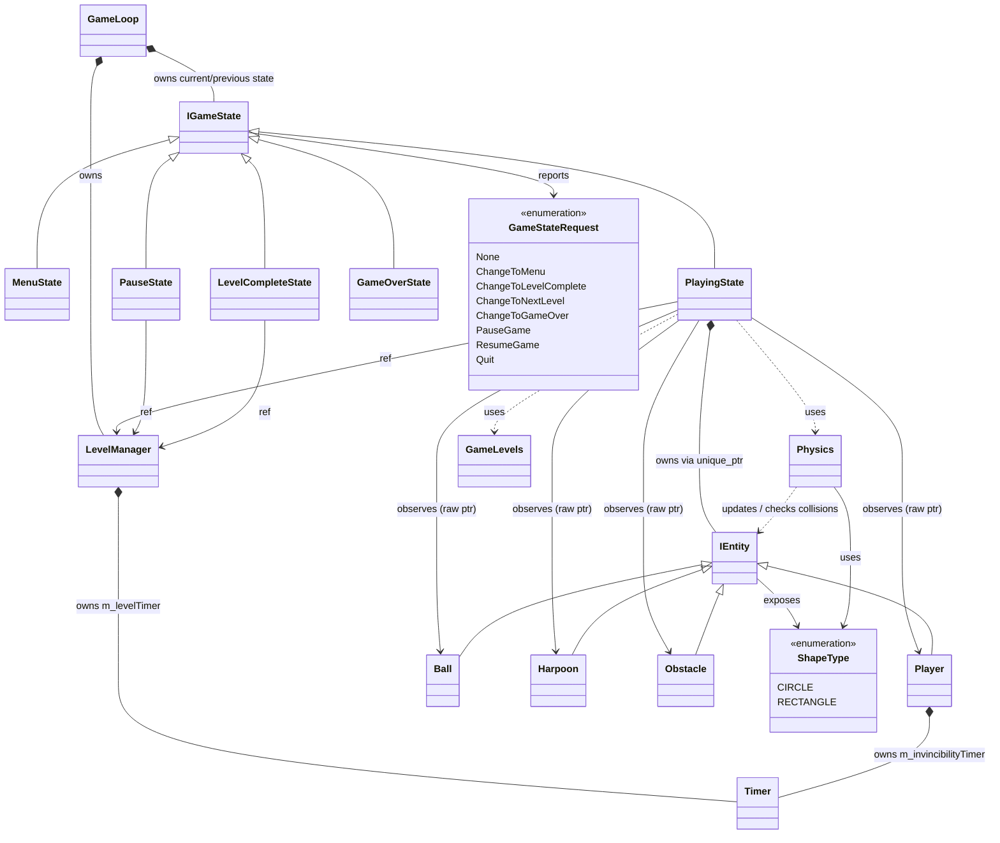

```mermaid
classDiagram
    class GameLoop
    class LevelManager
    class Timer
    class IGameState
    class MenuState
    class PlayingState
    class PauseState
    class LevelCompleteState
    class GameOverState
    class IEntity
    class Player
    class Ball
    class Harpoon
    class Obstacle
    class Physics
    class GameLevels
    class GameStateRequest {
        <<enumeration>>
        None
        ChangeToMenu
        ChangeToLevelComplete
        ChangeToNextLevel
        ChangeToGameOver
        PauseGame
        ResumeGame
        Quit
    }
    class ShapeType {
        <<enumeration>>
        CIRCLE
        RECTANGLE
    }

    GameLoop *-- IGameState : owns current/previous state
    GameLoop *-- LevelManager : owns

    LevelManager *-- Timer : owns m_levelTimer
    Player *-- Timer : owns m_invincibilityTimer

    IGameState <|-- MenuState
    IGameState <|-- PlayingState
    IGameState <|-- PauseState
    IGameState <|-- LevelCompleteState
    IGameState <|-- GameOverState
    IGameState --> GameStateRequest : reports

    PlayingState --> LevelManager : ref
    PlayingState *-- IEntity : owns via unique_ptr
    PlayingState --> Player : observes (raw ptr)
    PlayingState --> Ball : observes (raw ptr)
    PlayingState --> Harpoon : observes (raw ptr)
    PlayingState --> Obstacle : observes (raw ptr)
    PlayingState ..> Physics : uses
    PlayingState ..> GameLevels : uses

    PauseState --> LevelManager : ref
    LevelCompleteState --> LevelManager : ref

    IEntity <|-- Player
    IEntity <|-- Ball
    IEntity <|-- Harpoon
    IEntity <|-- Obstacle

    IEntity --> ShapeType : exposes
    Physics ..> IEntity : updates / checks collisions
    Physics --> ShapeType : uses
```
