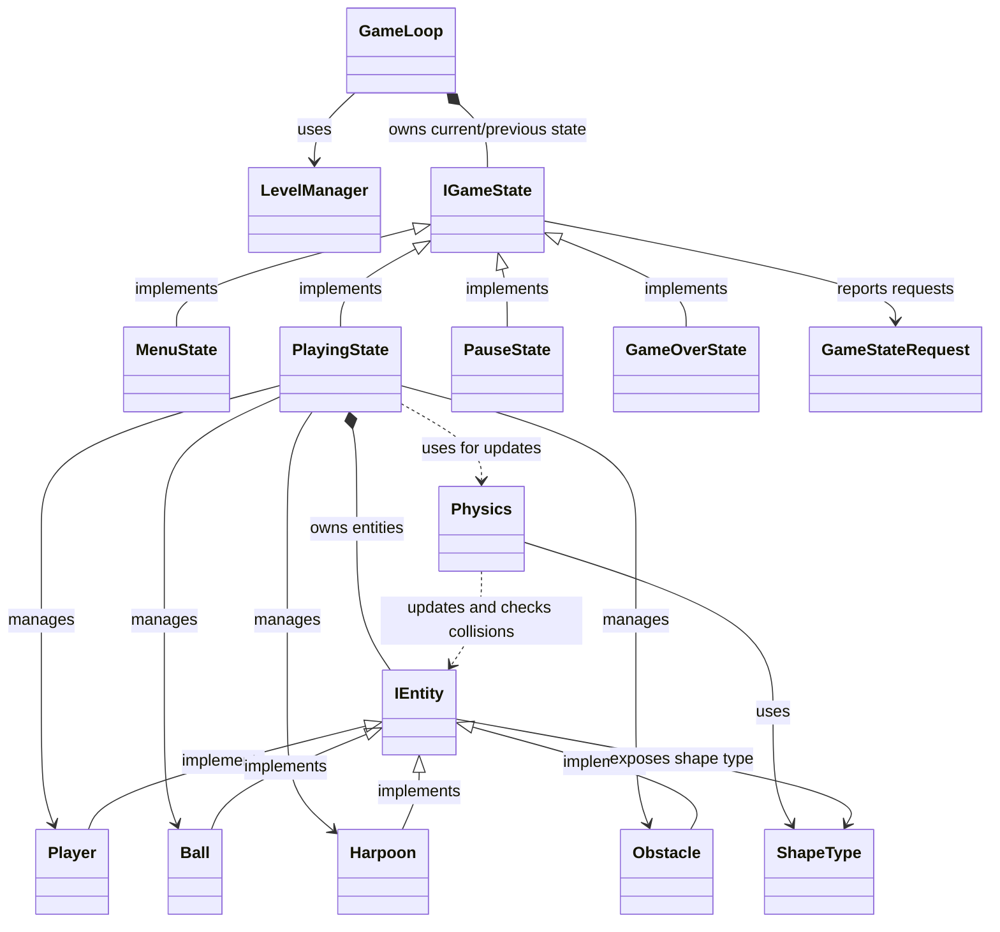

```mermaid
classDiagram
    class GameLoop {
    }

    class LevelManager {
    }

    class IGameState {
    }

    class MenuState {
    }

    class PlayingState {
    }

    class PauseState {
    }

    class GameOverState {
    }

    class IEntity {
    }

    class Player {
    }

    class Ball {
    }

    class Harpoon {
    }

    class Obstacle {
    }

    class Physics {
    }

    class GameStateRequest {
    }

    class ShapeType {
    }

    GameLoop *-- IGameState : owns current/previous state
    GameLoop --> LevelManager : uses

    IGameState <|-- MenuState : implements
    IGameState <|-- PlayingState : implements
    IGameState <|-- PauseState : implements
    IGameState <|-- GameOverState : implements
    IGameState --> GameStateRequest : reports requests

    PlayingState *-- IEntity : owns entities
    PlayingState --> Player : manages
    PlayingState --> Ball : manages
    PlayingState --> Harpoon : manages
    PlayingState --> Obstacle : manages
    PlayingState ..> Physics : uses for updates

    IEntity <|-- Player : implements
    IEntity <|-- Ball : implements
    IEntity <|-- Harpoon : implements
    IEntity <|-- Obstacle : implements

    Physics ..> IEntity : updates and checks collisions
    Physics --> ShapeType : uses
    IEntity --> ShapeType : exposes shape type
```