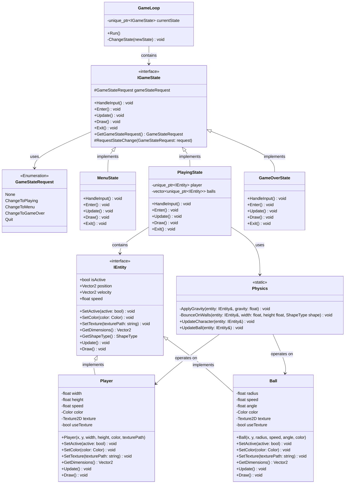

```mermaid
classDiagram
    class GameLoop {
        +Run()
        -unique_ptr~IGameState~ currentState
        -ChangeState(newState) void
    }

    class GameStateRequest {
        <<Enumeration>>
        None
        ChangeToPlaying
        ChangeToMenu
        ChangeToGameOver
        Quit
    }

    class IGameState {
        <<interface>>
        +HandleInput() void
        +Enter() void
        +Update() void
        +Draw() void
        +Exit() void
        +GetGameStateRequest() GameStateRequest
        #RequestStateChange(GameStateRequest: request)
        #GameStateRequest gameStateRequest
    }

    class MenuState {
        +HandleInput() void
        +Enter() void
        +Update() void
        +Draw() void
        +Exit() void
    }

    class PlayingState {
        -unique_ptr~IEntity~ player
        -vector~unique_ptr~IEntity~~ balls
        +HandleInput() void
        +Enter() void
        +Update() void
        +Draw() void
        +Exit() void
    }

    class GameOverState {
        +HandleInput() void
        +Enter() void
        +Update() void
        +Draw() void
        +Exit() void
    }

    class IEntity {
        <<interface>>
        +bool isActive
        +Vector2 position
        +Vector2 velocity
        +float speed
        +SetActive(active: bool) void
        +SetColor(color: Color) void
        +SetTexture(texturePath: string) void
        +GetDimensions() Vector2
        +GetShapeType() ShapeType
        +Update() void
        +Draw() void
    }

    class Player {
        -float width
        -float height
        -float speed
        -Color color
        -Texture2D texture
        -bool useTexture
        +Player(x, y, width, height, color, texturePath)
        +SetActive(active: bool) void
        +SetColor(color: Color) void
        +SetTexture(texturePath: string) void
        +GetDimensions() Vector2
        +Update() void
        +Draw() void
    }

    class Ball {
        -float radius
        -float speed
        -float angle
        -Color color
        -Texture2D texture
        -bool useTexture
        +Ball(x, y, radius, speed, angle, color)
        +SetActive(active: bool) void
        +SetColor(color: Color) void
        +SetTexture(texturePath: string) void
        +GetDimensions() Vector2
        +Update() void
        +Draw() void
    }

    class Physics {
        <<static>>
        -ApplyGravity(entity: IEntity&, gravity: float) void
        -BounceOnWalls(entity: IEntity&, width: float, height float, ShapeType shape) void
        +UpdateCharacter(entity: IEntity&) void
        +UpdateBall(entity: IEntity&) void
    }

    GameLoop --> IGameState : contains
    IGameState <|-- MenuState : implements
    IGameState <|-- PlayingState : implements
    IGameState <|-- GameOverState : implements
    IGameState --> GameStateRequest: uses
    
    PlayingState --> IEntity : contains
    IEntity <|-- Player : implements
    IEntity <|-- Ball : implements
    
    PlayingState --> Physics : uses
    Physics --> Ball : operates on
    Physics --> Player : operates on
```