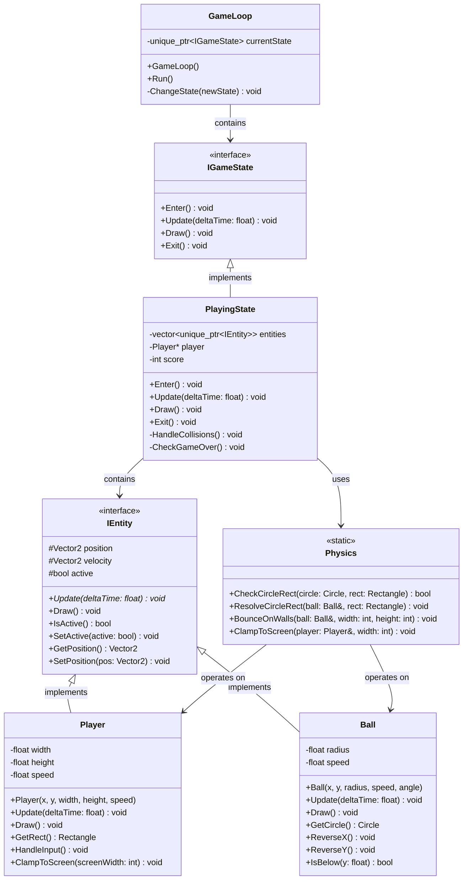

```mermaid
classDiagram
    class GameLoop {
        -unique_ptr~IGameState~ currentState
        +GameLoop()
        +Run()
        -ChangeState(newState) void
    }

    class IGameState {
        <<interface>>
        +Enter() void
        +Update(deltaTime: float) void
        +Draw() void
        +Exit() void
    }

    class PlayingState {
        -vector~unique_ptr~IEntity~~ entities
        -Player* player
        -int score
        +Enter() void
        +Update(deltaTime: float) void
        +Draw() void
        +Exit() void
        -HandleCollisions() void
        -CheckGameOver() void
    }

    class IEntity {
        <<interface>>
        #Vector2 position
        #Vector2 velocity
        #bool active
        +Update(deltaTime: float) void*
        +Draw() void
        +IsActive() bool
        +SetActive(active: bool) void
        +GetPosition() Vector2
        +SetPosition(pos: Vector2) void
    }

    class Player {
        -float width
        -float height
        -float speed
        +Player(x, y, width, height, speed)
        +Update(deltaTime: float) void
        +Draw() void
        +GetRect() Rectangle
        +HandleInput() void
        +ClampToScreen(screenWidth: int) void
    }

    class Ball {
        -float radius
        -float speed
        +Ball(x, y, radius, speed, angle)
        +Update(deltaTime: float) void
        +Draw() void
        +GetCircle() Circle
        +ReverseX() void
        +ReverseY() void
        +IsBelow(y: float) bool
    }

    class Physics {
        <<static>>
        +CheckCircleRect(circle: Circle, rect: Rectangle) bool
        +ResolveCircleRect(ball: Ball&, rect: Rectangle) void
        +BounceOnWalls(ball: Ball&, width: int, height: int) void
        +ClampToScreen(player: Player&, width: int) void
    }

    GameLoop --> IGameState : contains
    IGameState <|-- PlayingState : implements
    
    PlayingState --> IEntity : contains
    IEntity <|-- Player : implements
    IEntity <|-- Ball : implements
    
    PlayingState --> Physics : uses
    Physics --> Ball : operates on
    Physics --> Player : operates on
```